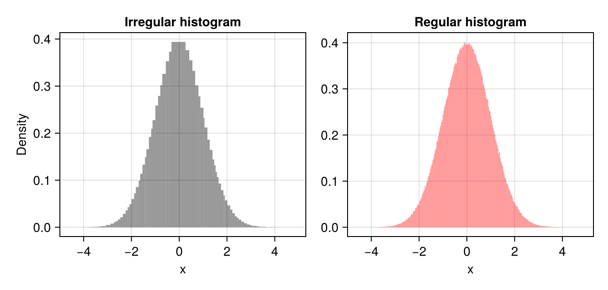

# Summary

`AutoHist.jl` is a Julia [@bezanson2017julia] package for fitting histograms to univariate data, with an automatic and data-based selection of the histogram partition.
It currently supports 8 irregular and 12 regular automatic histogram procedures from the statistics literature. Additionally, `AutoHist.jl` provides extensions for `Plots.jl` [@christ2023plots] and `Makie.jl` [@danisch2021makie],
allowing for simple visualization of the resulting histogram fits.

# Statement of need

To this day, histograms remain one of the most widely used nonparametric density estimators. Their popularity is in no doubt due to their simplicity and interpretability,
and they are routinely used by practitioners with limited mathematical backgrounds as a means of visualizing the distribution of data sets. 
Although the construction of a histogram for a given interval partition is a simple task, the quality of the resulting density estimate is very sensitive to the choice of bins.
As a result, the task of designing automatic histogram procedures, where the number of bins and their location are chosen in a data-driven fashion, has recieved considerable interest in the statistics community.
Despite advances in our understanding of different bin selection rules, many popular software libraries only include a limited number of simple rules for selecting a regular histogram partition,
and typically do not provide any support for automatic irregular histogram construction.
`AutoHist.jl` fills this gap by providing a fast implementation of state-of-the-art regular and irregular bin selection algorithms from the statistics literature. A complete overview of the bin selection procedures that have been implemented so far is given in **Table 1**.

| Rule | Type (regular/irregular) | Reference |
|-----------------------------------------|:-----------------|:-------------------------|
| Sturges rule                             | regular   | @sturges1926choice |
| Scott's rule                             | regular   | @scott1979optimal   |
| Freedman-Diaconis' rule                  | regular   | @freedman1981histogram |
| Akaike's Information Criterion (AIC)     | regular   | @hall1990akaike    |
| Bayesian Information Criterion (BIC)     | regular   | @davies2009automatic  |
| Birgé-Rozenholc                          | regular   | @birge2006bins |
| Minimum Description Length (MDL)         | regular   | @hall1988stochastic |
| Wand's rule                              | regular   | @wand1997data |
| Random Regular Histogram (RRH), Knuth    | regular   | @knuth2019optimal |
| Rozenholc et al. penalty A               | irregular | @rozenholc2010irregular |
| Rozenholc et al. penalty B               | irregular | @rozenholc2010irregular |
| Rozenholc et al. penalty R               | irregular | @rozenholc2010irregular |
| Bayesian Blocks                          | irregular | @scargle2013bayesblocks |
| Random Irregular Histogram (RIH)         | irregular | @simensen2025random |
| Normalized Maximum Likelihood (NML)      | both      | @kontkanen2007mdl |
| L2 cross-validation (L2CV)               | both      | @rudemo1982empirical |
| Kullback-Leibler cross-validation (KLCV) | both      | @hall1990akaike, @simensen2025random |
 

Table: Implemented bin selection procedures so far. For methods with type=both, a regular and an irregular variant of the criterion is supported.

We note that some automatic histogram selection rules have been implemented in Julia, typically as part of plotting libraries.
The `Plots.jl` package includes support for certain plug-in rules used in standard histograms, whereas the `StatsPlots.jl` library [@christ2023plots] provides functionality for plotting equal-area histograms.
The `R` package `histogram` [@mildenberger2019histogram] supports some regular and irregular histogram methods, but their implementation covers fewer criteria than ours.

# Installation and usage

The `AutoHist` package is part of the Julia general registry, and can as such be installed via the built-in package manager,
```julia
using Pkg
Pkg.add("AutoHist")
```

To illustrate the basic use of the software, we fit a histogram based on the Random Irregular Histogram criterion and a regular histogram based on Akaike's Information Criterion to a standard normal random sample of size $n = 10^6$.

```julia
using AutoHist, Random, Distributions

n = 10^6
x = rand(Xoshiro(1812), Normal(), n)         # synthetic data

h_irr = fit(AutomaticHistogram, x, RIH())    # fit an irregular histogram
h_reg = fit(AutomaticHistogram, x, AIC())    # fit a regular histogram
```

The call to the `fit` method returns an object of type `AutomaticHistogram`, with fields recording the chosen histogram partition, estimated density and bin counts. `AutoHist.jl` provides plotting recipes for `Plots.jl` and `Makie.jl`, which allows the user to easily visualize the fit. Here, we show how to plot the irregular and the regular histogram fitted in the aabove code snippet using `Makie`.

```julia
import CairoMakie, Makie # using the CairoMakie backend

fig = Makie.Figure(size=(670, 320))
ax1 = Makie.Axis(fig[1, 1], title="Irregular histogram", xlabel="x",
                 ylabel="Density")
ax2 = Makie.Axis(fig[1, 2], title="Regular histogram", xlabel="x")
p_irr = Makie.plot!(ax1, h_irr, alpha=0.4, color="black")
p_reg = Makie.plot!(ax2, h_reg, alpha=0.4, color="red")
fig
```



# References